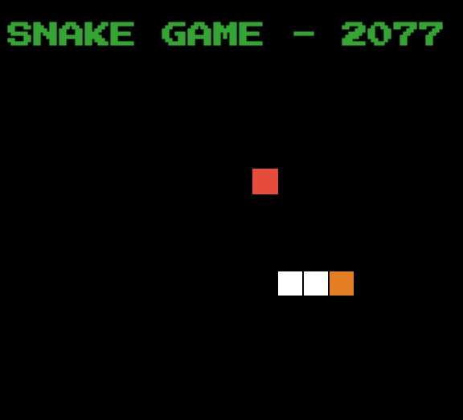

  <a href="#-sobre-o-projeto">Sobre</a> •
  <a href="#tecnologias">Tecnologias</a>

 

 <h4 align="center"> 🚧 Projeto Snake-2077 🚀 Em construção... 🚧
  </h4>

# imagem

<h1 align="center">
   
</h1>

<!--Sobre o projeto-->
<h2 align="center">💻 Sobre o projeto</h2>

No bootcamp da Digital Innovation One em especial no curso de HTML Web developer  tivemos como desafio de projeto recriar o famoso jogo **Snake**.

## Tecnologias

- [x] **HTML**
- [x] **CSS**
- [x] **JAVASCRIPT**

#### Ferramentas

- [**VS CODE**](https://code.visualstudio.com/)

<h4 align=center>Desenvolvido por Felipe Holanda <a href="https://www.linkedin.com/in/felipe-holanda-de-freitas-3a91281a2/"><strong>Entre em contato</strong> :)</a></a></h4>

